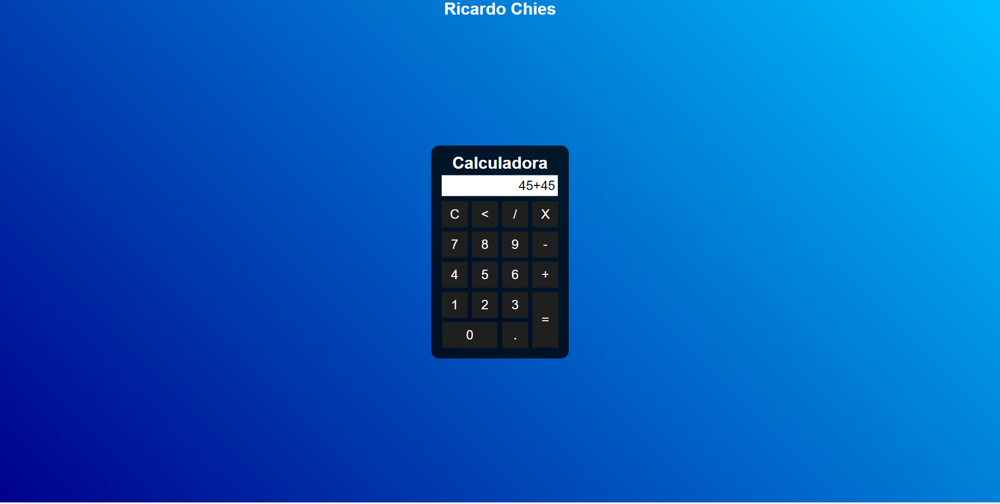

# Calculadora-JS

# Descrição
Uma Calculadora simples.  
Realiza as 4 operações matemáticas.

# Layout do Projeto

  

# Tecnologias Utilizadas

<ul>
  <li>HTML 5</li>
  <li>CSS 3</li>
  <li>JavaScript</li>
</ul>

# Autor
José Ricardo Chies Gonçalves

LinkedIn:
https://www.linkedin.com/in/ricardo-chies-087557216/

E-mail:
chies.dev@gmail.com

